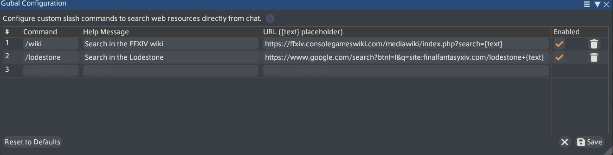

# Gubal

> Open web pages, wikis, and Lodestone articles in your browser directly from your Final Fantasy XIV chat bar.

Inspired by the `/wiki` command from **Guild Wars 2**, **Gubal** lets you open web pages in your default browser straight from the in-game chat bar. Named after the Great Gubal Library, just type a slash command followed by what you're looking for, and Gubal opens the destination page right away—making it effortless to jump directly to specific guides, item pages, and online resources.

---

## Commands & Examples

### `/wiki [query]`
Opens the [FFXIV Console Games Wiki](https://ffxiv.consolegameswiki.com/) in your browser. Typing specific terms jumps straight to concrete guides:

- `/wiki great gubal library` &rarr; opens [The Great Gubal Library](https://ffxiv.consolegameswiki.com/wiki/The_Great_Gubal_Library) dungeon guide
- `/wiki sightseeing log` &rarr; opens the [Sightseeing Log](https://ffxiv.consolegameswiki.com/wiki/Sightseeing_Log) guide
- `/wiki relic weapons` &rarr; opens the [Relic Weapons](https://ffxiv.consolegameswiki.com/wiki/Relic_Weapons) progression guide
- `/wiki blue mage spells` &rarr; opens the [Blue Mage Spells](https://ffxiv.consolegameswiki.com/wiki/Blue_Mage_Spells) list

### `/lodestone [query]`
Searches the official [Final Fantasy XIV Lodestone](https://na.finalfantasyxiv.com/lodestone/) and opens the matching page in your browser:

- `/lodestone patch 7.56` &rarr; opens [Patch 7.56 Notes](https://na.finalfantasyxiv.com/lodestone/topics/detail/a8a526ad64db45c8ca8d1c7fdcce8a5eedaa18bc) directly
- `/lodestone maintenance` &rarr; opens latest server maintenance and status notices
- `/lodestone eorzea database excalibur` &rarr; opens official Eorzea Database item details
- `/lodestone community finder` &rarr; opens the Community Finder for Free Companies

### `/gubal`
Opens the in-game configuration window to add, edit, or customize search commands with the `{text}` placeholder.

---

## Configuration

Type `/gubal` in chat to manage your search commands:

- **Add Commands:** Specify the slash command name, an optional help message, and the destination URL containing `{text}` where your query will be inserted.
- **Enable / Disable:** Toggle commands on or off with the checkbox without deleting them.
- **Edit / Delete:** Modify existing entries or remove them using the trash icon.
- **Reset to Defaults:** Restore the default `/wiki` and `/lodestone` commands at any time.

 <i>Config window with the default commands</i>

---

## Installation

1. Ensure [XIVLauncher](https://goatcorp.github.io/) / [Dalamud](https://github.com/goatcorp/Dalamud) is installed.
2. In-game, type `/xlplugins` to open the Dalamud Plugin Installer.
3. Search for **Gubal** and click **Install**.

---

## License

This project is licensed under the MIT License - see the [LICENSE](LICENSE) file for details.